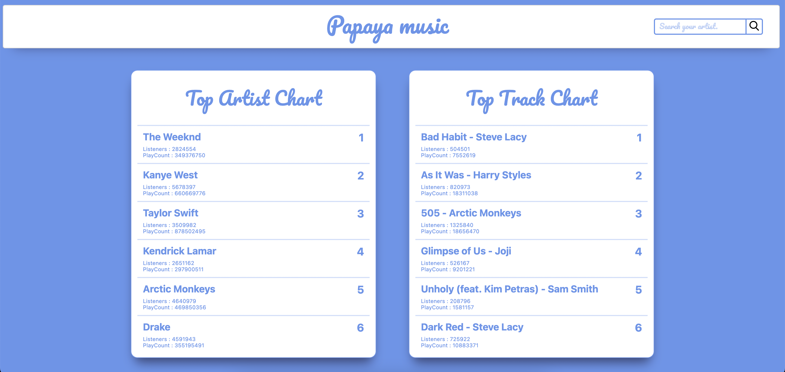
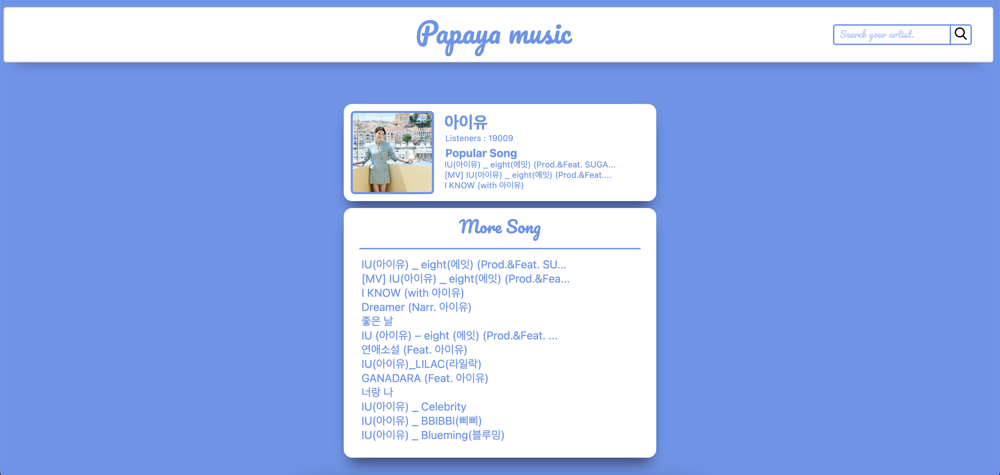
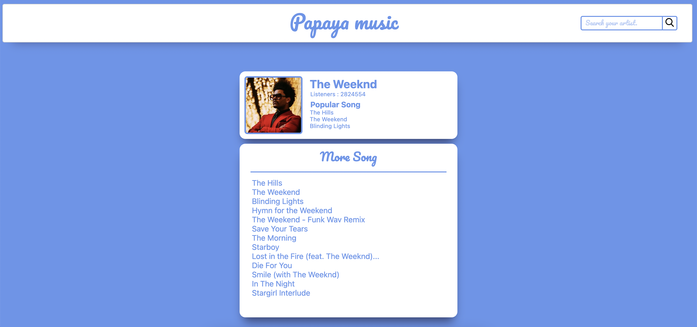

## Papaya Clone coding
#### How to Run
$ git clone https://github.com/Ubinquitous/clone-papaya.git  
$ npm install yarn  
$ yarn install  
$ yarn run dev  
http://localhost:3000로 접속하기  
\* 이미지를 불러오고 싶으시면, 따로 카카오 디벨로퍼에서 REST API KEY를 받아 env 파일에 추가하셔야 합니다 *

#### Respect [@SEOKKAMONI](https://github.com/SEOKKAMONI)  
#### Original Link : [Click Me](https://github.com/SEOKKAMONI/Music-service-Web)

### 좋아하는 가수들을 검색하고, 탑 차트를 알아볼 수 있는 웹사이트입니다.
### last fm api와 카카오 이미지 검색 API를 사용하여 만든 Next JS 앱입니다.

